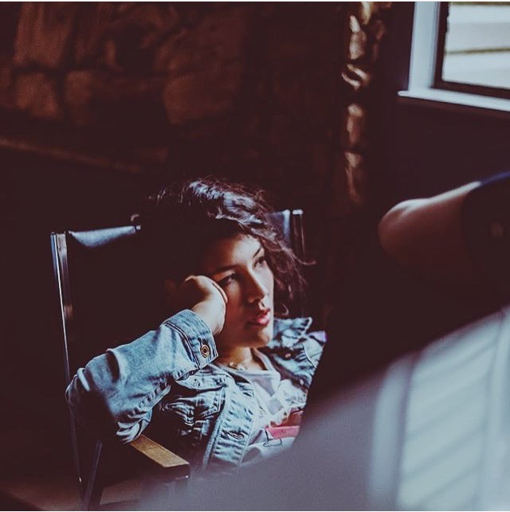

# About

Hey there,

I'm Marielle Sam-Wall (they/them). I was born on the unceded/stolen territories of the of the [xʷməθkʷəy̓əm (Musqueam)](https://www.musqueam.bc.ca/), [Sḵwx̱wú7mesh (Squamish)](https://www.squamish.net/), and [səlilwətaɬ (Tsleil-Waututh) Nations](https://twnation.ca/) *(if you don't know where this is, I encourage you to look it up)* to parents of Cantonese & German ancestry.

I've had the privilege to work in many different and diverse areas that have greatly shown me the beauty of the environment. Such as food security, cultural revitalization, construction, performing arts, accessibility, community engagement 

**[my website](https://community.emergentfutures.io/courses/5566525/content)**
