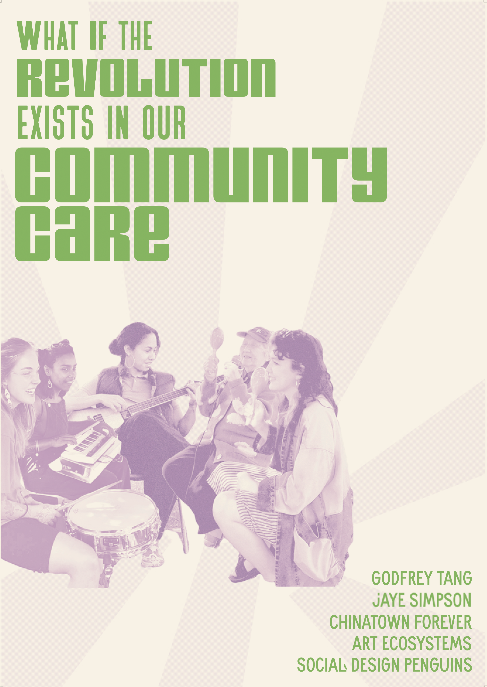

---
hide:
    - toc
---

# Bootcamp
<h2> Poster </h2>

<h3>What if the revolution exists in our community care?</h>

My poster is a question to what our “fight” is meant to look like. Often, we think of revolutionary action as violent or aggressive, but what if it was soft, gentle, and caring? Instead of one big “fight” the revolution can look like daily radical acts of care for those in our community.
I wanted my poster to serve as a reminder to me and others that community care is both necessary and revolutionary in itself. It features a group of my friends with an elder in our community playing music in a local park, the names of my mentors, and some projects from home that inspire me. As we are going to look at these posters almost every day, I wanted the poster to be the example of what I am doing this for: the joy and thriving of ALL in society. 

<h2> Reflection </h2>
