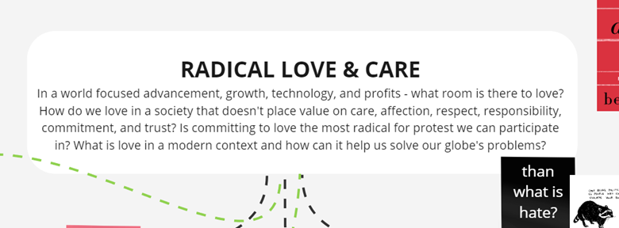
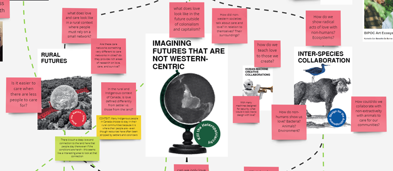

---
hide:
    - toc
---

# Atlas of Weak Signals

## THE SHORT (I know we are all short on time)
For my design space the weak signals I chose were:

- Imagining Futures that are not Western-Centric
- Rural Futures
- Interspecies Collaboration
- Human-Machine Creative Collaborations

I hope to explore each weak signal in relation to my fight – community care and love. I’ve worked in community care for most of my career, as I am naturally drawn to it, but I wanted to explore topics like Machine-Learning AI, Rural Making, and Interspecies perspectives all in relation to how each can have the capacity of love.

This feels particularly relevant to me as I feel we are in a time of our society where people feel disenchanted with what Western society has to offer. In a society that feels particularly “loveless” and somewhat hopeless, isn’t it the time to explore what it really means to love – in as many forms we can imagine?

With these weak signals, some areas of opportunity I would like to explore are:

- How can the care networks in small rural communities harnessed to secure their future? Through tech or through environmental collaboration?
- How could visualizing love and care from our non-human counterparts create a deeper connection to them?
- What does love look, feel, sound and taste (?) like at different scales of our society? Both human and non-human scales?

## THE LONG (Hey, if you want to get to know me and my work better, this is a WAAY better way)

Surrounded by plants, insects, friends, and the sound of the city in the Jardin de Mariposas each of us in our class set off to build our own design space. With my new <a href="https://www.youtube.com/watch?v=L7yyGwTrT5g&ab_channel=FabLabBarcelona"> Atlas of Weak Signals cards </a> in hand and the explanation from our lovely lecturer, [Marianna Quintero](https://iaac.net/dt-team/mariana-quintero/), I set off to find the cards that I resonated most with.

I started by drawing from the weak signal category I felt most drawn to: “Kill the Heteropatriarchy”. I think what drew me to this category was the aggressive nature the name and how the words choice was in direct contrast to my desired focus of this masters: Radical Love and Care. *(Hey, I know we got to kill/dismantle some things to make way for some radical love – but the dichotomy made me smile, ok?)*

*Yes, I wrote myself a thesis statement – can you tell I love structure?*

So, [if you may have read](https://marielle-wall.github.io/MDEF/temr1/01-Bootcamp/) *(or may not have read, I don’t think I wrote that much)* in my first reflection, my “fight” is for community care. It is largely more of a question about what it looks like to radically pursue love in a Western/Colonial society that doesn’t value it. And with that fight, I think you can guess what my first and most important card is: “Imagining Futures that are not Western-Centric”… Then came “Rural Futures”, “Interspecies Collaboration”, and “Human-Machine Creative Collaborations”.

 *As you can see, I am basically just filled with questions about everything – no real answers, just a sh*t ton of questions*

Much of my past-work revolved around my love for people, but I want to begin exploring what it means to show acts of love to our environment and other species. Much of humanity’s relationship to non-humans is purely extractive. We often see ourselves as above non-humans, not equal to, therefore many think non-humans are incapable of care and love. I want to challenge and explore this belief and am curious about what it means to love non-humans and how non-humans love us.

This same thought process extends to the Human-Machine Creative Collaboration. We’ve created machines to be tools of personal and individual self-serving interest. They often operate for a specific task or with baked in bias that other humans are set out to harm other humans. But what would it look like if we made machines to care? And are they even possible of doing that?

Now for the card I feel that might be the most out of place: Rural Futures *(I really want to work in a rural community, OK?)*. I believe there is so much potential in rural area – in both research AND project work. The close-knit community networks make for an interesting case study in how community must care for each other when resources are less accessible. Additionally, in the context of Canada and the Indigenous people who’s land it is stolen from – I think there is a lot of potential to better understand the non-western ideologies around how people see themselves as part of the environment and how they could potentially use tech in non-extractive ways to care for their surroundings.

SOOO all these weak signals are really just a vehicle to feed my obsession about what it means to love and care for each other. “Imagining Futures that are not Western-Centric” works as the overarching theme, as love and care is not particularly valued in our current society *(kind of weird for a society that is so obsessed with it though?)*, and to imagine love as our way forward is *(to me)* inherently radical. Then “Rural Futures”, “Interspecies Collaboration”, and “Human-Machine Creative Collaborations” provide a rich research and experimentation space to understand what love really looks like and what it could be.

If you want to check out my full Design Space, [I encourage you to follow this link to my miro!](https://miro.com/app/board/uXjVPOimLrg=/?share_link_id=41125234929) I will do my best to update it throughout the semester, so peep into it when you can!

BUT since I now vaguely know what I wanna look into, I think next steps involve research how I should define love in my work 😊
