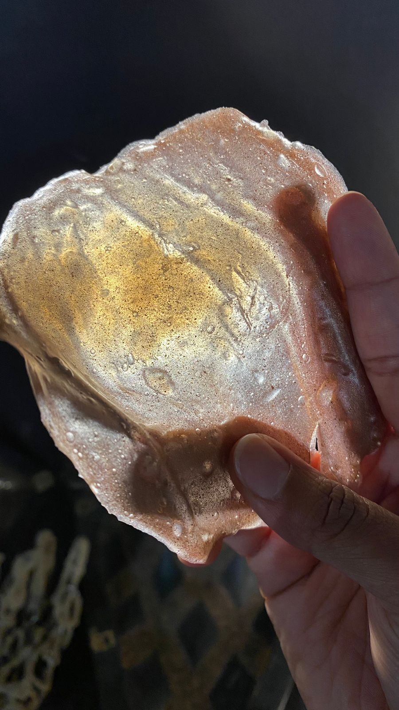

---
hide:
    - toc
---

# Bio & Agro
##2 Weeks in Bio and I have no idea what is happening
OK I am not going to lie, these weeks were a little hard for me. I was sick for a large part of the course content, and I most definitely found my attention waning when I was in class. Maybe it was just an off two weeks for me or maybe my intention currently lies elsewhere, but I did have fun doing experiments.

One thing I am sad I missed because I was so sick was making of the biomaterials! I got to see the aftermath of their making, which was very fun! A lot of them were sticky and bouncy, which I REALLY enjoyed, as a tactile loving person.

I will say, event though I wasn’t in the class, I had lovely friends recount it to me and they said somethings that made me really think about biomaterials in a different way. I always believed that biomaterials are this big cool thing for the planet *(I really knew nothing about them honestly…)* but they told me that even if they are “biological” they are still a source of creating more – depleting more. This made me wonder if we can ever really be “sustainable”, if even biological materials create waste…

## Scientific Articles - Do I understand you?
### *(the answer is probably no)*

Years ago, I heard an episode of a race & culture podcast on NPR, [Code Switch](https://www.npr.org/podcasts/510312/codeswitch) where they talked about how racism and trauma affect our genomes. The journalists talked about how after WWII the Netherlands faced a large famine where many people faced severe starvation. Scientists then studied the ancestors of those who faced this trauma and found many different health issues, including diabetes, high-blood pressures, and even schizophrenia.

<iframe src="https://www.npr.org/player/embed/576818478/576901155" width="100%" height="290" frameborder="0" scrolling="no" title="NPR embedded audio player"></iframe>
*You can listen to it here*

Not really being a biology person I thought this was a great place to start looking into trauma, history, and the effects of it on our biology. Unfortunately, this is a burgeoning field *(damn, so I can’t just have my trauma’s cured from science?)*, and while I wanted to research DNA specifically, it was quite difficult to pinpoint one exact article.

<iframe width="560" height="315" src="https://www.youtube.com/embed/pBkVx12yc2M" title="YouTube video player" frameborder="0" allow="accelerometer; autoplay; clipboard-write; encrypted-media; gyroscope; picture-in-picture" allowfullscreen></iframe>
*There may not be that many papers – but check out what some amazing scientists are doing*

So fittingly I thought “Let’s look at LOVE” (can you tell I am obsessed?) and can you guess what hormone that lead me to? OXYTOCIN! Colloquially known as the “love hormone”, [this hormone is released into the hypothalamus to biologically facilitate childbirth and attachment](https://www.health.harvard.edu/mind-and-mood/oxytocin-the-love-hormone ).
In National Geographic’s [“Is Maternal Instinct Only for Moms? Here’s the Science”]( https://www.nationalgeographic.com/science/article/mothers-day-2018-maternal-instinct-oxytocin-babies-science), a grandmother/researcher tested her and her husband’s oxytocin levels before and AFTER meeting their infant grandchild. What she found is that her oxytocin level’s spiked 63% after the visit while her husband’s only 23%. BUT do not fret (it isn’t like men don’t feel attachment to their infants) after prolonged exposure to the grandchild, her husband’s oxytocin levels also raised to 63%.

This casual experiment demonstrated that our instinct to parent and care for others is BIOLOGICAL – that there are biological elements in how we care for each other, beyond social constructs. So next that got me interested in what happens if we introduce oxytocin to situation where this is no instinct to care.

This is where the Youtube video from before comes in, following that line of thought, I found [an article that was about the effect of injecting oxytocin into virgin mice and how it influenced them to care for young that was not their own](https://www.nature.com/articles/nature14402.epdf?sharing_token=4cVxmkv3f98AI5w1ICvmC9RgN0jAjWel9jnR3ZoTv0OI6KSCxCvfZxAiwGkWz2iICLzwMZEcY1eqX7s-JqtjtkVwU1Gn9YoVIuboznXZPYoQT-OsbOSoZEQSf3ekR7MR54ZI7Waa2ehjL_vMxabEh6O1XapxeLkdZDFM29PDWAtQDCPhwUq_q6Ll7qedoJHyAh4kVzdRCPWCUH_8stfARkzdfdLtZNXsso_0d-kyFk0%3D&tracking_referrer=www.nationalgeographic.com). When exposed to lone baby mice outside of the nest virgin female mice either ignore them or cannibalized them. But researchers found that if these virgin mice are injected with oxytocin, they began to show mothering instincts and would care for the baby mice and bring them back to the nest.

The virgin mice were paired with both with mothering mice and other virgin mice to see learned behaviors could effect the mice as well. When the virgin mice were paired with mothing mice, their caring instincts appeared much faster, even in the mice who weren’t injected with oxytocin. While learned behaviors played a large role in the caring instincts, they also found that virgin mice who were injected with oxytocin and were paired with other virgin mice still showed caring instincts and retrieved lost pups.

This finding, for me, is very important as it shows there is something innate in nature for animals to care for offspring, even when it isn’t their own. This makes me wonder how much is our ability to care is up to our hormones and how much is societal influence. What could therapy possibly look like if we take into account our hormones? Could hormone treatment become something that treats things other than physical illnesses and gender dysphoria?
