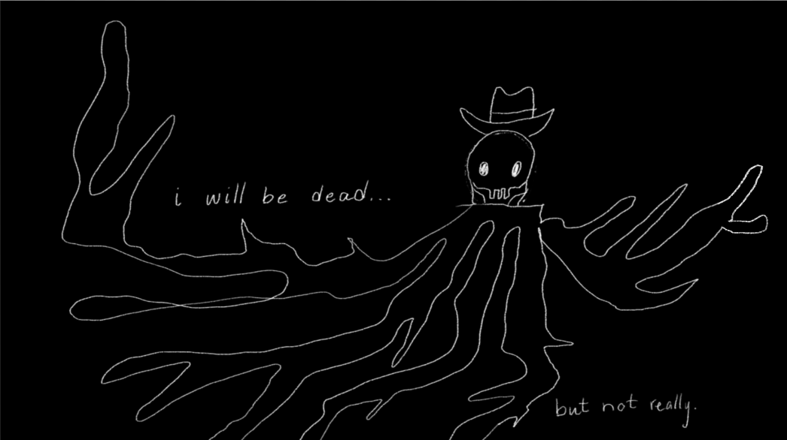
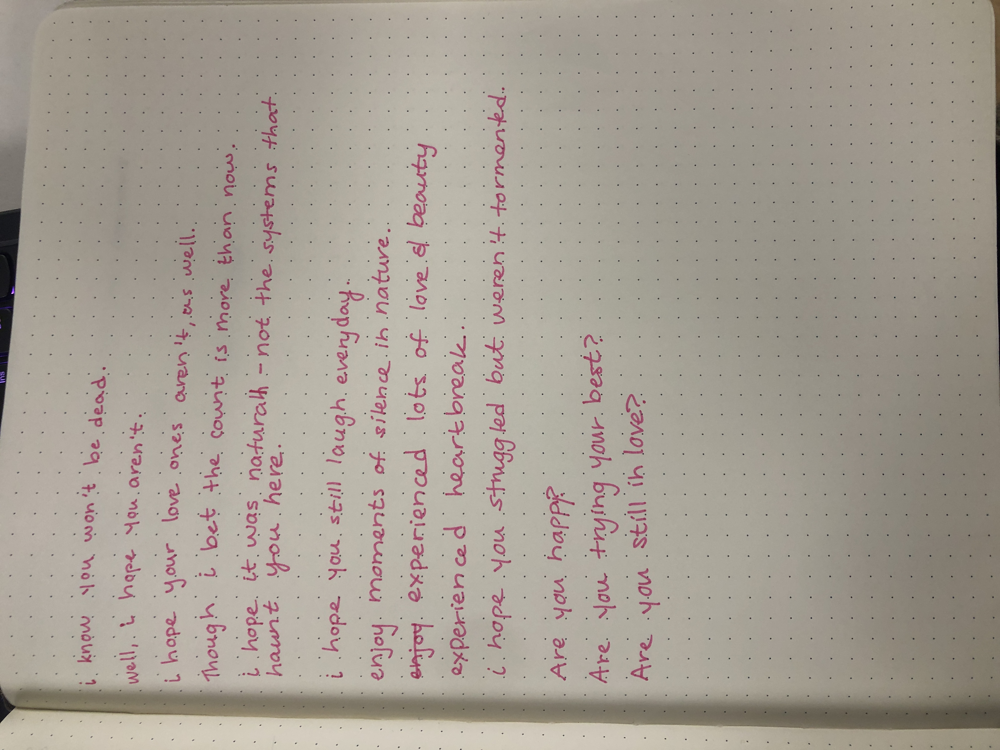

---
hide:
    - toc
---

# The Next Billion Seconds

##Deliverables
###In the Next Billion Seconds
We were challenged to think about where we will be in the next billion seconds and I wanted to do something futuristic and sci-fi. Inspired by Micheal Deforge's comic ["Sticks Angelica: Folk Hero"](http://www.michael-deforge.com/sticks-angelica-folk-hero), I am imagining that like the self named character, Micheal Deforege, I have been buried in the ground up to my neck.

During my time buried, I have spread out into the ground. My arms and legs have become like roots throughout the earth. I cannot be pulled out of the ground because my roots run too deep – that pulling me out would destroy both me and my surroundings. I also cannot move, I am just a head in the ground. In a way I am both dead and not dead.

Here’s the picture I drew to imagine it and the little poem I wrote along with it.

>in the next billion seconds
>i will be dead…
>i will not have a daily routine. i will be dead.
>i will not eat breakfast. i will be breakfast for others.
>there will be headlines, but i can't read them. i will be dead.
>i will be next to my ancestors, so i'll be happy
>but still... dead.
>
>my only occupation is to watch the world as it passes me.
>the music i listen to will be of the birds and breath.
>my social life is bustling as the ground and sky has many good friends.
>i will have a lot of free time to enjoy these sweetnesses. i will be dead.
>
>i will not be reading anything. i will be dead.
>my mind will always be off, yet full of knowledge. i will be dead.
>
>in the next billion seconds
>the earth has kept going. i have just joined it.
>i will be dead.

<iframe src="https://player.vimeo.com/video/794932199?h=7d53a989c3&amp;badge=0&amp;autopause=0&amp;player_id=0&amp;app_id=58479" frameborder="0" allow="autoplay; fullscreen; picture-in-picture" allowfullscreen style="position:absolute;top:0;left:0;width:100%;height:100%;" title="video-output-4C339CBD-475F-4527-B301-C1311FE763B2.mp4"></iframe>

*(I am also working on a little video to answer this - but drawing takes a lot of time! Here is the draft)*

###Timecapsule Presentation

Google slides does not let me embed them into the website... [So here is the link to the presentation](https://docs.google.com/presentation/d/107fKXGNEeSpYtFzY3p7to2Dr1ZKaNlNFXIKJXO-pcQM/edit?usp=sharing).

###Letter to myself

*(I hope this isn't to simple! It is honestly really what I hope for my future and would want to know)*

###Reflection
I feel like I have been waiting the entire masters for this class. It was most definitely a breath of fresh air and a sigh of “FINALLY”. This was like if someone took the presentation of my dreams and just made it – so I am extremely grateful to have taken part in these activities.

In all transparency, I am writing this 2 week after the class so it is a little difficult for me to fully remember and reflect on every aspect of the course. Though the thing that stuck out for me was Andres energy as a facilitator. Often times when we think of the future, many people feel quite depressed about it and it can be very difficult to tackle with optimism *(which I think I crazy because I am often so excited about what the future can hold- but also am very aware of how scary it seems atm)*. I think how gentle and calm Andres was and how he spoke about his work really helped many in the class get to a more positive place when they think about the future, which I think is really beautiful.

This class was also very validating to be part of. Many things that I have been talking about (care, justice, etc.) was talked about and therefore valorized within the course and this design space. It was a moment that I really desperately needed and was very thankful to receive during the first week back from the course.

Don’t have much else to say other than: Andres – please keep in contact! Best wishes with the baby and all the love and joy!

---
##What I created this week

###Spoken
<iframe width="100%" height="166" scrolling="no" frameborder="no" allow="autoplay" src="https://w.soundcloud.com/player/?url=https%3A//api.soundcloud.com/tracks/1437552271%3Fsecret_token%3Ds-smz11dGvv9m&color=%23ff0000&auto_play=false&hide_related=false&show_comments=true&show_user=true&show_reposts=false&show_teaser=true"></iframe>
<a href="https://soundcloud.com/marielle-wall" title="Marielle Wall" target="_blank" style="color: #cccccc; text-decoration: none;">Marielle Wall</a> · <a href="https://soundcloud.com/marielle-wall/jan-9-so-beautiful/s-smz11dGvv9m" title="Jan 9 - So Beautiful" target="_blank" style="color: #cccccc; text-decoration: none;">Jan 9 - So Beautiful</a>

<iframe width="100%" height="166" scrolling="no" frameborder="no" allow="autoplay" src="https://w.soundcloud.com/player/?url=https%3A//api.soundcloud.com/tracks/1437552595%3Fsecret_token%3Ds-qn11Ue2ZYsh&color=%23ff0000&auto_play=false&hide_related=false&show_comments=true&show_user=true&show_reposts=false&show_teaser=true"></iframe>
<a href="https://soundcloud.com/marielle-wall" title="Marielle Wall" target="_blank" style="color: #cccccc; text-decoration: none;">Marielle Wall</a> · <a href="https://soundcloud.com/marielle-wall/jan-10-start-shit-where-shit-needs-to-get-started/s-qn11Ue2ZYsh" title="Jan 10 - Start Shit Where Shit Needs To Get Started" target="_blank" style="color: #cccccc; text-decoration: none;">Jan 10 - Start Shit Where Shit Needs To Get Started</a>

