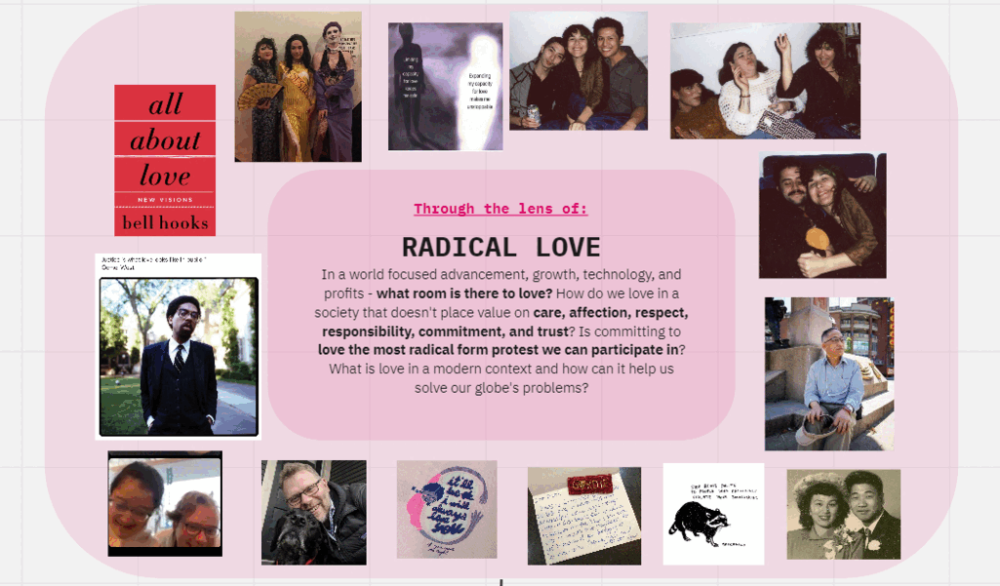
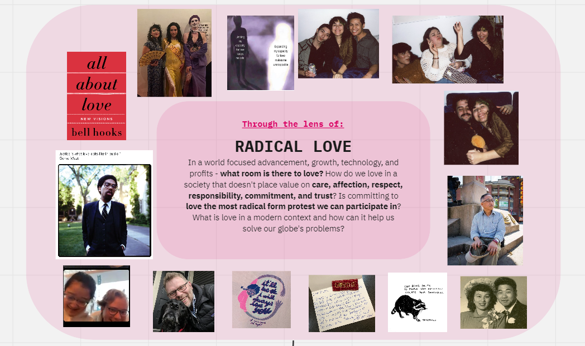
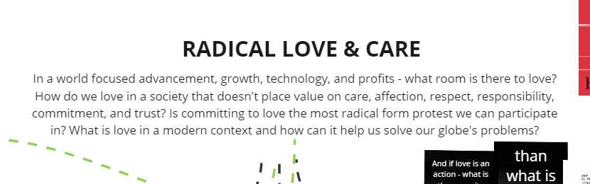
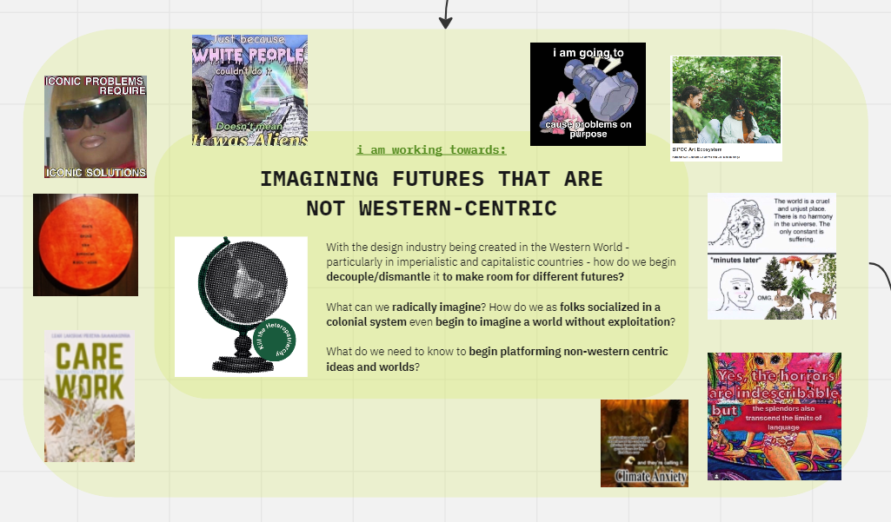
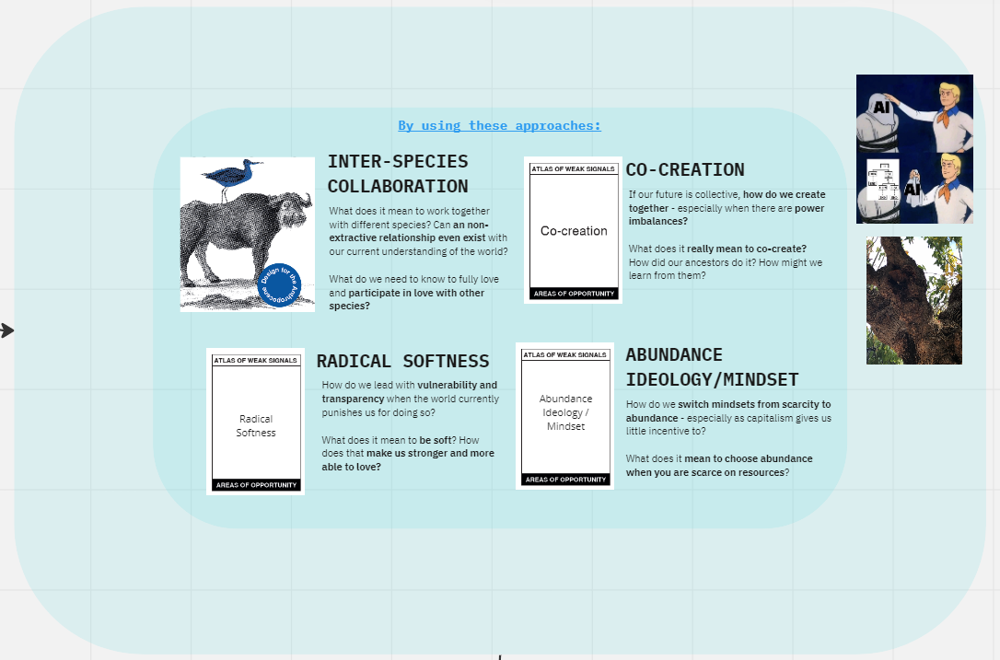
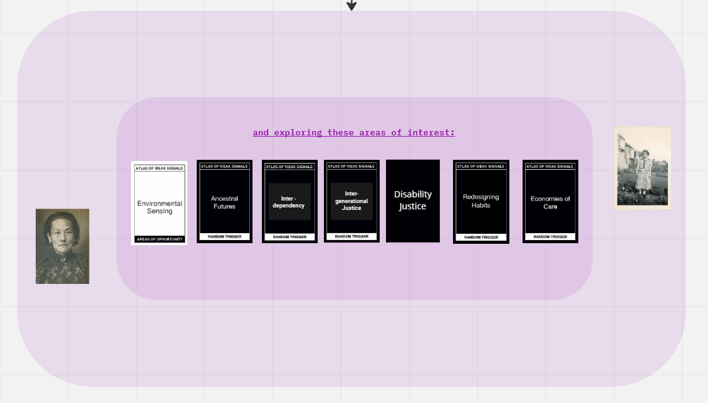

---
hide:
    - toc
---

# Redesigning My Design Space

> [Check out my design space here](https://miro.com/app/board/uXjVPOimLrg=/?share_link_id=865906909973)

For the most part, I liked how I originally set up my design space. I generally feel very solid in its direction and believe it is very true to who I am.

I think this rework is more about communicating my mind to others, more than anything. I feel the original *([see this page](https://marielle-wall.github.io/MDEF/term1/02-AtlasofWeakSignals/))* captures what goes on in my brain, while the updated is a sleeker versions that I could potentially share with others and get more precise feedback.

I reframed my design space to be more of a declaration of intention. When you put each section together it reads:

>Through the lens of Radical love, i am working towards imagining futures that are non-western centric. I will do this by using the following approaches: Inter-species Collaboration, co-creation, radical softness, & abundance ideology/mindset. And by exploring these following areas of interest: Environmental Sensing, Ancestral Futures, Inter-dependency, Inter-generational Justice, Disability Justice, Redesigning Habits, & Care Economies

*(ok this can definitely be copy edited to be clearer! But isn't that what next term is for?)*

##"Through the lens of: Radical Love"

Wanting to always touch on Radical Love, I made it the first item I mention. In the previous rendition, I framed my work as "Radical Love & Care". This term, I got rid of the term "Care" within this title.

*(for your reference!)*

This is as I felt I only added on "Care" because I felt others wouldn't take me as seriously if I just talked about Love. Though, throughout the last months, I have come to realize if people want to write me off because I'm talking about a subject they deem as "unprofessional" or unworthy of investigation, then those aren't the people I want to talk to.

What I am talking about is Love - care is part of Love but care along isn't Love *(you get what I am saying???)*. Love is radical and Love in itself is worthy of investigating how it can be used to create justice in a world so lacking it. I do not need to bend or wordsmith to make my work more "professional" for folks who wouldn’t want to engage anyway *(well for now that is)*.

## “i am working towards: imagining futures that are non-western centric”

Throughout the last term, I felt this was the weak signal that was the most emergent as it was one that I found myself deeply in search for. There was a real lack of imagination *(and general content)* when it came to platforming non-western centric futures – we really got futures that were in alignment with what Europe already has envisioned. Because of this lack, I felt that I needed to commit to this weak signal fully, as I believe it is really one of the most important for us to move forward TOGETHER.

## “By using these approaches: Inter-species collaboration, co-creation, radical softness, & abundance ideology/mindset”

The next level was about how I want to approach different topics – hoping to use one or all of these cards to lead how I explore. This is in hope to help me specify an approach to my work and maybe build ways that approach could look like.

## “and exploring these areas of interest: environmental sensing, ancestral futures, inter-dependency, inter-generational justice, disability justice, redesigning habits, and economies of care.”

Lastly, I identified my areas of interest that I am hoping to explore more. With each intervention, I hope to touch on one or more of these topics. I am specifically interested in exploring Ancestral Futures & Inter-dependency.

## “Term 1: Love & how we think about it”

With my design space set up, I mapped my interventions from the first semester and attempted to pull some reflections from them. For each I assigned the cards that were most relevant, rated my success, and then listed some takeaways to bring forward.
I also put some general thoughts I had and named the semester and what came of it *(which you can see in the title)*.

##Next Intervention: Daily ASL

The next intervention that I have been working on is incorporating pidgin ASL into my everyday. I am working with my friend, [Rosalind Ho](https://www.bchandsandvoices.com/post/my-message-to-parents-disability-does-not-equal-disadvantage/), who is Deaf and uses a cochlear implant. She is helping provide deeper context to ASL and correct me when I am signing correctly. In the future I am also hoping she will help create materials and videos on how to incorporate pidgin ASL into everyday settings.

The goal of this intervention is to expand our communication and how we connect with one another. Additionally, for Rosalind, it is to get more people to understand that we shouldn’t just rely on verbal communication and that many different forms of communication are valid and worth learning.
Together we have come up with of list of signs we can think are easy to incorporate into our everyday lives and are creating a video to pass on this knowledge!
