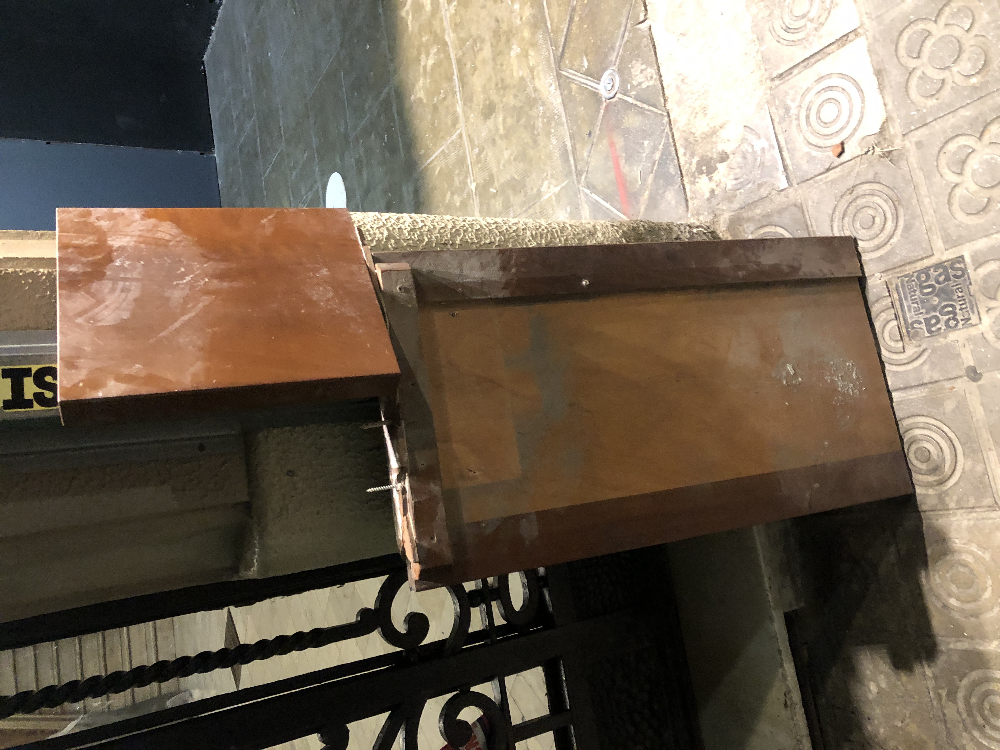

---
hide:
    - toc
---

# Digital Prototyping for Design

##Deliverables

### Feb 1 - Experimenting with a Buzzer

<iframe width="560" height="315" src="https://www.youtube.com/embed/71EKYx_SiM0" title="YouTube video player" frameborder="0" allow="accelerometer; autoplay; clipboard-write; encrypted-media; gyroscope; picture-in-picture; web-share" allowfullscreen></iframe>

Pretty easy exercise! The main problem I had was just when I tried to write code on my own, and there was no pitch library set up. But that was easily solved by pulling from an example already built into Arduino.

Tried a couple of other songs, which as always was fun. For me the best part was when the song would play and people in the class would sing along! Truly very cute.

### Feb 2 - Building 3D Things

First, we were challenged to draw a croissant parametrically:

*(it is so cute, right??)*

Then told to explore a 3D software and I made this:

Based off of this:

And here is a video with my reflections and goofing around:

<iframe width="560" height="315" src="https://www.youtube.com/embed/bYVK2oejeLE" title="YouTube video player" frameborder="0" allow="accelerometer; autoplay; clipboard-write; encrypted-media; gyroscope; picture-in-picture; web-share" allowfullscreen></iframe>

### Feb 8

<iframe width="560" height="315" src="https://www.youtube.com/embed/OEIIVJ0kwmE" title="YouTube video player" frameborder="0" allow="accelerometer; autoplay; clipboard-write; encrypted-media; gyroscope; picture-in-picture; web-share" allowfullscreen></iframe>

So we didn't end up figuring it out... Jordan did spend a lot of time working on it, but he wasn't able to finish it before he got busy with the baby.

Hope this is enough!

### Feb 9

<iframe width="560" height="315" src="https://www.youtube.com/embed/QjTfSRjDeAk" title="YouTube video player" frameborder="0" allow="accelerometer; autoplay; clipboard-write; encrypted-media; gyroscope; picture-in-picture; web-share" allowfullscreen></iframe>

Planning to use this mold in the studio soon! LMK if you want an update *(or I can just bring it to the FabLab!)*

### Micro-Challenge I

#### Museum of Colonization (MOC)

Here is a little video *(my instagram stories downloaded)* explaining our project:

<iframe src="https://player.vimeo.com/video/801156884?h=14e80c359d&amp;badge=0&amp;autopause=0&amp;player_id=0&amp;app_id=58479" frameborder="0" allow="autoplay; fullscreen; picture-in-picture" allowfullscreen style="position:absolute;top:0;left:0;width:100%;height:100%;" title="Microchallenge I - MDEF &amp;#039;23"></iframe>

You should also check out [our team notion](https://www.notion.so/Marielle-Stella-Carolina-MDEF-22-23-34fdfc848ec44d93bae61fdf263d6c88) and our [Github](https://github.com/stella-dikmans/MOC).

And here is my video reflection for the week:
<iframe width="560" height="315" src="https://www.youtube.com/embed/6wgV4987OVg" title="YouTube video player" frameborder="0" allow="accelerometer; autoplay; clipboard-write; encrypted-media; gyroscope; picture-in-picture; web-share" allowfullscreen></iframe>

If you want the project files, please check out [this link *(which is basically our GitHub)*](https://github.com/stella-dikmans/MOC/tree/main/files).

###Feb 22

<iframe width="560" height="315" src="https://www.youtube.com/embed/UW120-cAVh4" title="YouTube video player" frameborder="0" allow="accelerometer; autoplay; clipboard-write; encrypted-media; gyroscope; picture-in-picture; web-share" allowfullscreen></iframe>

SOOOO I know we were supposed to scan the thing we made after BUT I ran in to a couple problems:

  1. My phone is too old to 3D scan things with any existing apps :'(
  2. Edu said that because my stamp is transparent and small that it wouldn't scan properly using the 3D scanner in the FabLab
  3. Edu offered that I 3D scan something else, and I really couldn't be bothered *(sorry but it's true)*. I wanted to just move forward and work on some secret projects for the design dialogues *(hopefully it will be done)*

Hope I don't get docked too much, but understand you gotta do what you gotta do.

###Feb 23

<iframe width="560" height="315" src="https://www.youtube.com/embed/jp6Z0vgaeK4" title="YouTube video player" frameborder="0" allow="accelerometer; autoplay; clipboard-write; encrypted-media; gyroscope; picture-in-picture; web-share" allowfullscreen></iframe>

###March 1

Ok, so couldn't get myself to make a video about this. Seems I am pretty low energy these days. BUT I am going to attempt a written reflection *(I know, I know, hold you applause)*.

This class was about lighting a LED through various methodology. I found this one of the most engaging classes as it was very hands on and well facilitated. I enjoyed the set up of:

- Try it out *(fuck around)*
- Learn the theory *(and find out)*

Because my computer weirdly doesn't work with the ESP32 Feather, I borrowed a laptop from the FabLab to do the work. I enjoyed learning about how we made the different networks and how we connected to the internet.

I think in the future, I would like to go deeper into creating devices and design objects that have their own little networks. But we will see what I create next semester!

Here is a video of when we synced up some of the lights! *(very cute)*

<iframe width="560" height="315" src="https://www.youtube.com/embed/WuJbjdaZwrs" title="YouTube video player" frameborder="0" allow="accelerometer; autoplay; clipboard-write; encrypted-media; gyroscope; picture-in-picture; web-share" allowfullscreen></iframe>

###March 2

SOOOOO i was not here this day... But I am going to do this and I have a plan >:)

I found these round table-like shapes on the street on March 8th. They need tops, so I want to bring them in and create tops for them.

The plan for the shorter one is to actually build a lamp into it! Will post when it is updated (will send you, Santi, an email when it is all done!).
...

Sooooo with the end of the semester, I didn't get a chance to use the CNC. I have every intention of doing so and got the wood I want to cut the tops with but just couldn't make the times to get it done. Know you can't give full marks for it, but you will see me using the CNC next semester!

##Micro-Challenge II

<iframe width="560" height="315" src="https://www.youtube.com/embed/fHsk4pYTUzk" title="YouTube video player" frameborder="0" allow="accelerometer; autoplay; clipboard-write; encrypted-media; gyroscope; picture-in-picture; web-share" allowfullscreen></iframe>

You can check out the [github](https://github.com/stella-dikmans/MOC-II/blob/main/README.md) and our [notion](https://hickory-polonium-fd1.notion.site/Marielle-Stella-Carolina-MDEF-22-23-34fdfc848ec44d93bae61fdf263d6c88).

An overview reflection for now is:

- Electronics are 10x more difficult than you think they will be
- I really enjoy doing the mechanical things!
- Always ask people if they want an explanation before assuming they need one.
