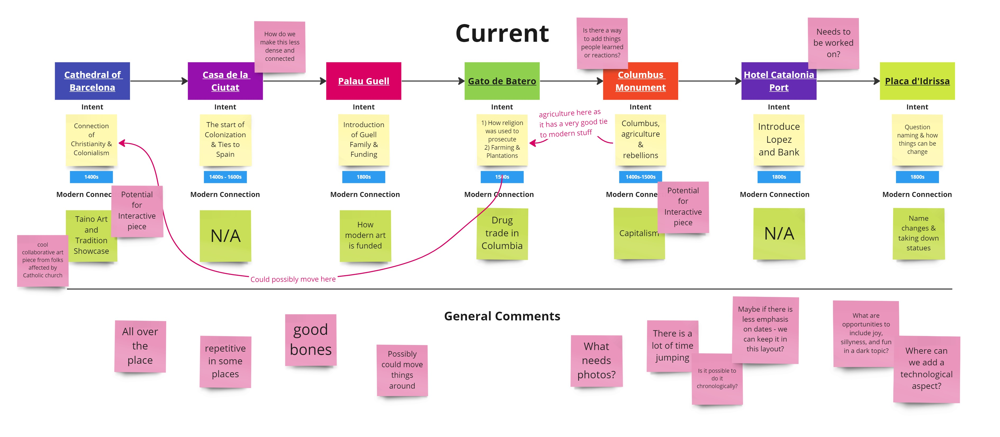
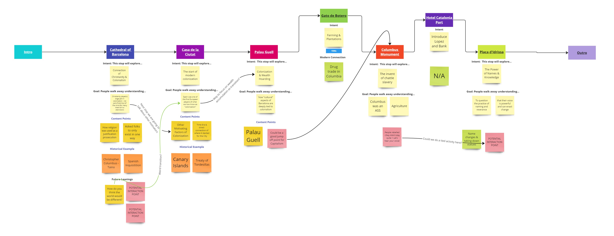
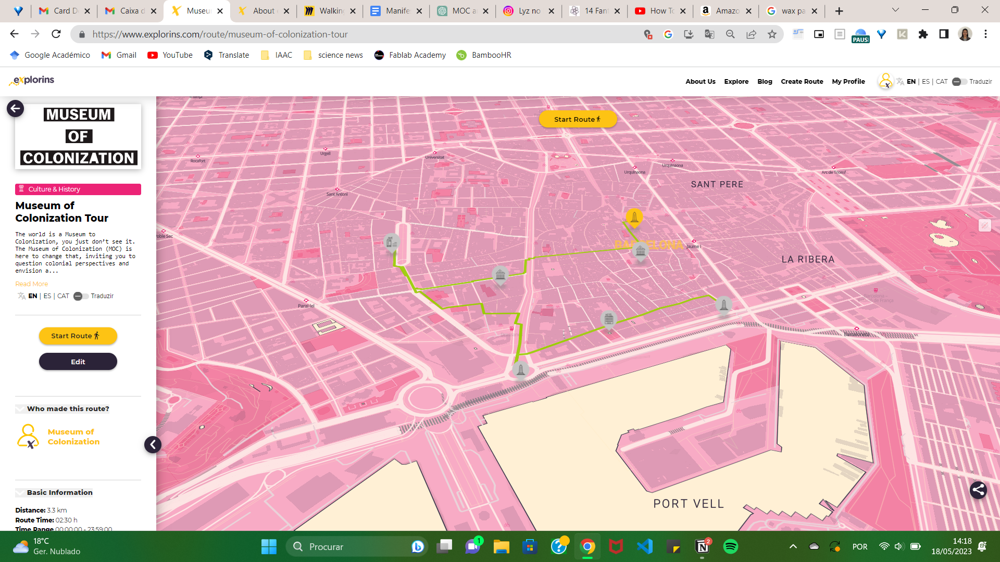

---
hide:
    - toc
---

#Prototyping for Design

##Deliverables

### Robots (Wild Card)
For this class, we explored the topic of robots and the software associated with them. Specifically, we focused on a robotic arm and how Rhino & Grasshopper can be used to control it.

I must admit that I'm not particularly enthusiastic about robots at the moment. The technology behind them remains somewhat mysterious to me, and my brain definitely struggled to comprehend the intricate details of their control mechanisms. During the Grasshopper-Rhino exercise, I did my best to follow along, but I found myself quite perplexed by it all.

However, there was one aspect that I genuinely enjoyed, and that was the opportunity to manipulate the robot arm. Although I didn't personally give it a try, I expected the task to be relatively straightforward. To my surprise, it turned out to be quite challenging, primarily due to the various dimensional aspects involved. As someone who operates in a three-dimensional space as a non-robot entity, I had never truly considered the intricacies of a robot's movements and the specific requirements it would entail.

*(On the website, it states that we have to document a Grasshopper task, but I remember Josep saying that we don't need to. Additionally, individuals who have been marked as completed don't have to do it. So, does it need to be completed?)*

###Introduction to Blender

Victor introduced us to Blender in this session. I have previous experience with Blender for 3D animation and modeling, and I was aware of its open-source nature. However, it was fascinating to learn more about its history and dedication to the open-source field.

One aspect of Blender that I wasn't aware of before is its integration with Python *(or whether it is built with Python?)*. In the upcoming classes, we will delve into how this integration affects its usage, so I won't delve into it now.

During this class, one thing that stood out to me was how much I enjoy working with Blender. While I had been using Maya and Rhino *(as we had to purchase it for this course)*, I had forgotten how much I appreciate modeling in Blender. Looking ahead, if I continue to have access to 3D printers, I would love to further explore Blender and use it to create costumes and similar projects.

###Live Coding as a Human Interface
Unfortunately, I was unable to attend the session on live coding. However, I do have some experience with live coding in the context of Arduino-to-Processing. So it aided in my understanding slightly.

After reviewing the lecture on the website, I couldn't help but feel a little disappointed that I couldn't be there in person. I have a genuine interest in exploring how coding can be utilized to create performances. Specifically, I have been keen on acquiring these skills to contribute to the development of stages and performances with my drag friends.

I must admit that understanding this class from a distance is a bit challenging for me. Although I have some coding experience, it has become rusty, and I find coding to be quite intimidating. Consequently, when I went through the material on my own, it seemed to go over my head.

However, one aspect of the documentation that I truly appreciated was the list of key questions. I believe it's a great addition in terms of evaluating the types of interactions we aim to build. I will definitely make a note of it for future reference, especially if I begin working on live code projects for my drag friends.

###Blender as an Interface
This class was a topic that I would love to explore more in the future. I enjoyed seeing the combination of Blender and Python to enable live control. I wish we had more time to delve deeper into this topic.

While I was aware that Blender had the capability for live inputs, I had the impression that Unity was more commonly used for this type of work. It was exciting to witness how we could connect the sensors in our phones to influence what appeared on our computer screens *(although, in practice, I don't believe any of us managed to get it to work)*. It's easy to overlook the components present in the technology we use every day, and this type of integration has sparked my curiosity about exploring even more possibilities for hacking and experimentation.

Once again, when this methodology resonates with me, I would love to dedicate more time to exploring it further, particularly in the realm of drag and performance-based projects.

###Microchallenge III
Can’t believe this is our last microchallenge! Sorry no video this time to capture how the MOC team did it. But then again, we didn’t do anything too big this time around.

Our focus of the challenge was to refine our MOC Tour that we are planning for the MDEF festival. We spent the first day mapping out the feedback from the first tour and getting specific about the intention of each stop.

*outlining our feedback*

*how we redefined each stop*

Once we got specific about the intention of each stop, we took a multi-pronged approach to creating this week. We looked at the following topics:

- How to utilize a collaboration opportunity with the firm [Explorins](https://www.explorins.com/home)
- the creation of a booklet to go along with the tour

The collaboration with Explorins and what we could possibly do with their online map/route based app, was more greatly explored by my peer [Carolina](https://carolina-mendes-almeida.github.io/MDEF/term3/prototype2/last/). She built a digital route of the tour using their app and wrote short descriptions for each stop.

*Image from Carolina's website*

During this microchallenge, my focus was towards the creation of our booklet, and I decided to explore physical and traditional methods of paper decoration. One particular technique that caught our attention was paper marbling. We experimented with acrylic ink by carefully placing it on the surface of water, creating patterns.

*gif from Carolina's Website*

In addition to the physical paper decoration techniques, we also reimagined the purpose and content of our booklet. Rather than simply conveying information, we decided to transform it into a space for participants to capture their reflections. We wanted each booklet to become a personal piece of artwork for the participants.

To achieve this, we included a series of stickers with each booklet. These stickers were designed to aid participants in their reflection process and provide them with creative elements to work with. By incorporating these stickers, we aimed to make each booklet unique and encourage participants to engage with their thoughts and express themselves artistically.

At the end of the week we presented our Explorins map and the intention for the booklet! You can see the presentation below:

  <iframe loading="lazy" style="position: absolute; width: 100%; height: 100%; top: 0; left: 0; border: none; padding: 0;margin: 0;"
    src="https:&#x2F;&#x2F;www.canva.com&#x2F;design&#x2F;DAFjSDMVPus&#x2F;view?embed" allowfullscreen="allowfullscreen" allow="fullscreen">
  </iframe>

<a href="https:&#x2F;&#x2F;www.canva.com&#x2F;design&#x2F;DAFjSDMVPus&#x2F;view?utm_content=DAFjSDMVPus&amp;utm_campaign=designshare&amp;utm_medium=embeds&amp;utm_source=link" target="_blank" rel="noopener">MOC Pitch Presentation</a>
