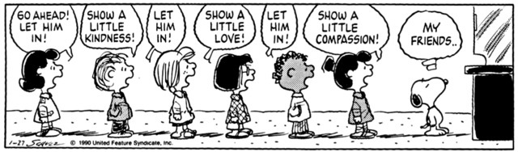

---
hide:
    - toc
---

#DistributedDesign

##Deliverables
Hello Lovely folks! So this week I am doing something a little different. I will be reflecting all in memes. Why you may ask? Because I like to experiment and communicate in different ways. I don’t know if I will be effective or not (or if I can find all the memes that truly capture my sentiment) but I will try.

PLUS I think memes are some of the most accessible ways to communicate thoughts, share laughs, and spark conversation.

###April 12
####Learning Skills

Facilitation, writing upside down, systems thinking. I do these as a job already *(except for writing upside down)*.

####Dynamics

Fun, i like my teammates.

####Interactions

###April 13
####Learning Skills

####Dynamics

####Interactions

###April 14
####Learning Skills

####Dynamics

####Interactions

*BONUS SECTION:* I think the intention of this seminar was a great. We need to begin taking account all of these factors. Though believe there are some accessibility issues when it comes to wording and fully understanding what Distributed Design is. Even I am still a little shaky on WHAT it is and it’s goals *(not to mention if it is achieving its goals)*.

Even on the website - the landing page says “What is Distributed Design?” but then tells you what the Distributed Design Platform is. I think just some wording and jargon gets in the way of the intentions of Distributed Design in a way that it undermines it’s own intentions to be “more **sustainable, open, inclusive and collaborative** practices.”

Unfortunately, wording and jargon is something we all tackle in this industry where talk is often platformed more than sustained action and work. Finding a balance is truly a challenge for all of us. Pleasing funders with fancy words VS. truly open, inclusive platforms - a battle faced to us under capitalism.
