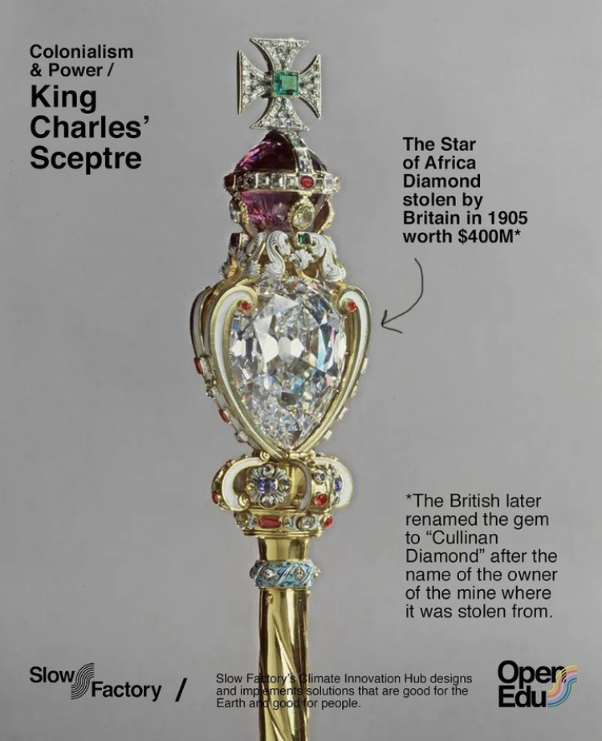
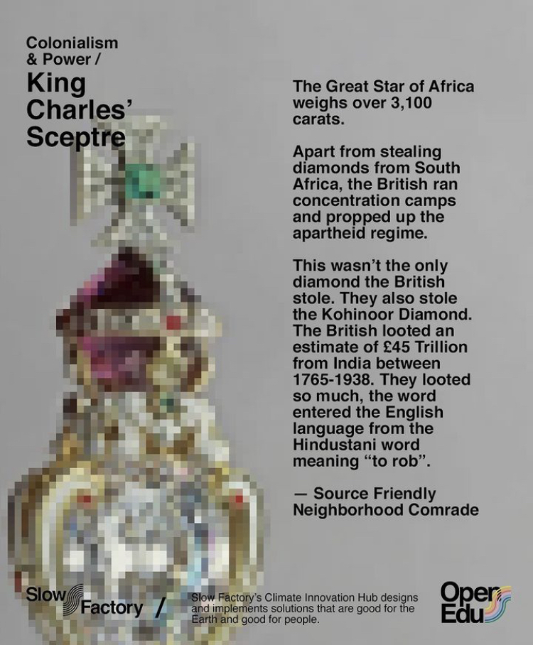
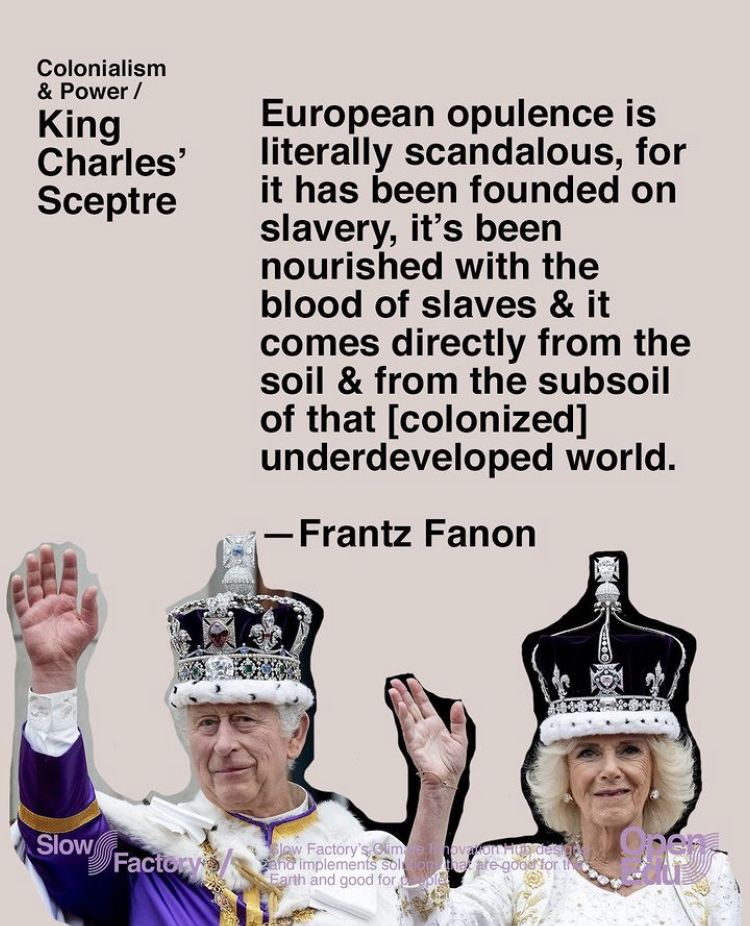

---
hide:
    - toc
---

#Collective Intelligences

##Deliverables
###Web 3 Idea

A DOA that challenge colonial ownership over artifacts. Where we play with the idea of image, theft, and ownership. The goal is to be controversial and replicate

1. DOA that creates NFTs of 3D scans of artifacts that were stolen from Africa, Asia, & the Americas by Colonial powers. The profits of the scans can be used to fund repatriation efforts and mutual aid for communities of the artifacts origin. The goal would be to have the museums call us out for “stealing”, turning a mirror onto what they did. *@Jonas Lund voting system*

how to create the NFTs staring with 3D scans of objects

1. Reimagining cultural objects that are held in high esteem by colonial powers by taking the “official” descriptions and feeding these into a generative AI that will transform the original 3D piece into something that includes its colonial history.

*e.g. Take 3D scans of opulent things that kings and queens have like crowns and jewels that have origins from different former colonies and take the original descriptions and add that things were stolen and the blood history of them and put those descriptions into an image generator and see how they turn out*

###Reflection

I'll be honest: I don't care for cryptocurrency, blockchain, or DAOs. I've made several attempts to understand the value they bring, but I struggle to find any convincing arguments beyond making money for a select few.

Some argue that non-government-controlled currency could benefit small autonomous communities, but I question whether communities could simply choose not to use currency altogether. The practical use of these technologies in helping communities seems limited to me.

I often find myself thinking, "Maybe I just don't understand blockchain." And truthfully, I probably don't fully comprehend it. However, even after this week of exploring the topic, I still can't grasp the strong "why" behind it. If anyone reading this can provide a simple explanation, I would appreciate it. Until then, I'll be racking my brain, trying to understand why we need a software like this.
